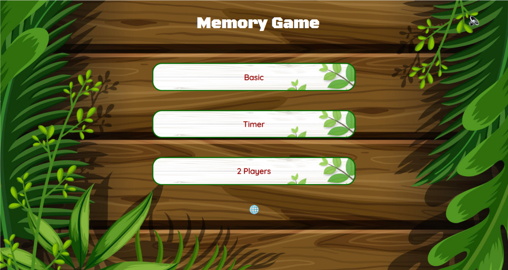
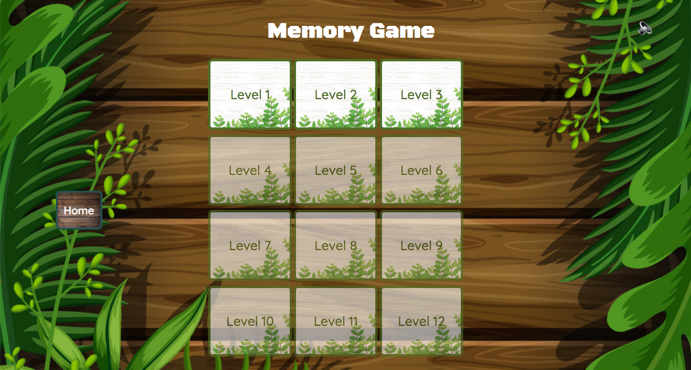
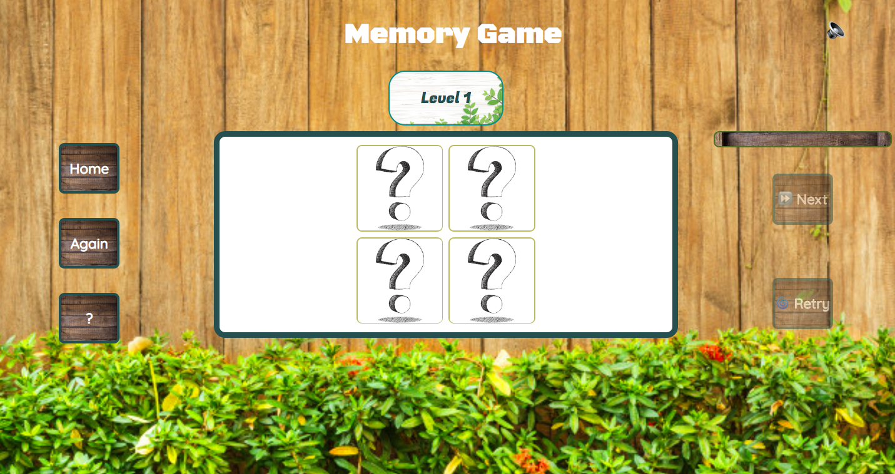
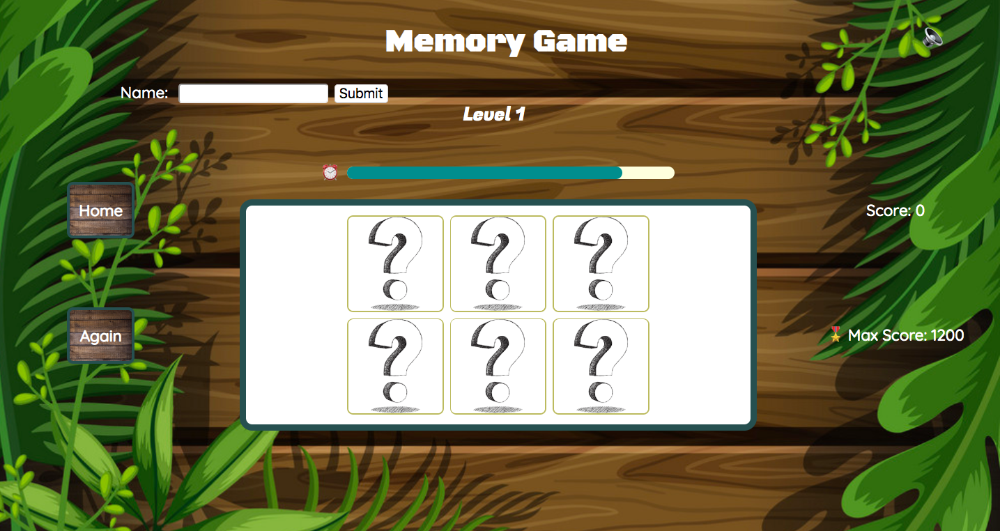
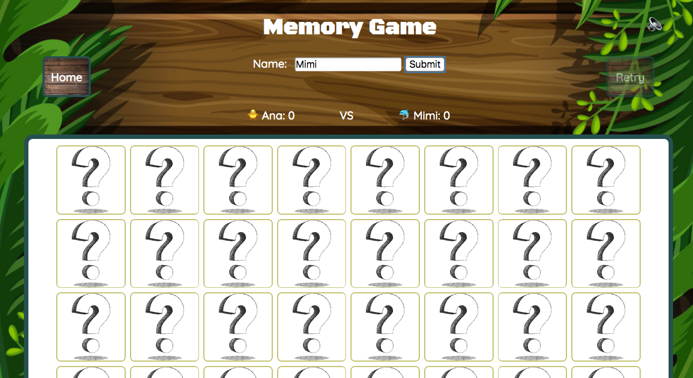
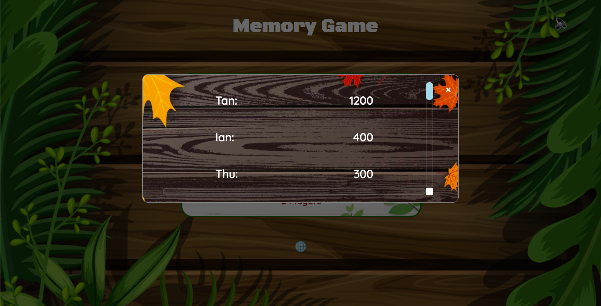

# The memory game scope

## Table of Content
- Introduction
- Sources to use
- Technology utilized
- Difficulties
- User Stories and Wireframes
- Extra Implementation
<!-- https://alvislim.github.io/Covid19-Interactive-dashboard/ -->

## Introduction
​
Memory game is a fun game, it's called that because the main skill in the game is your memory - how well you can remember the position of items. In this game, there are 3 modes: 
  - The first one is a basic mode, in which you can play freely step by step. 
  - The sencond one is more a little bit difficult, you have to complete each level in a certain time. 
  - The last one is two players mode, you can play with another person.
​
## Sources to use - API 
    <https://picsum.photos/> - to extract image data for game.
​
## Technology utilized
  1. Jquery to manipulate DOM element and append the images retrieved from API
  2. Ajax call to fetch data from open source API
  3. Javascript for the logic of matching images, calculate score of players, timer of each level
  4. LocalStorage to save the situation of levels, scores and names of players
  5. Jquery UI to create effects when players choose correct images, increase score
  6. HTML and CSS

## Difficulties
I encountered an issue while trying to make the images render faster when level starts. The images take along time to display on the screen, so when users play this game, in some cases they can not see the images clearly.

# User Stories and Wireframes
## WireFrame
  ### Main page

  ### List of levels of basic mode

  ### Basic mode page

  ### Timer mode page

  ### 2 players mode page

  ### Statistical page

## UserStory 1
As a user, I would like to see the list of all levels in the basic mode of this game, which level is activated.

## UserStory 2
As a User, I would like to turn on/off the sound when I am playing.

## UserStory 3
As a user, I would like to have a list of all players, their scores and who has the hightest score.

## UserStory 4
As a user, I would like to see how the timer runs in each level.

## Extra Implementation
Now this game can be displayed well on desktop, but on mobile or tablet I still have not made responsive design. Therefore, I want to make a mobile version of this game.